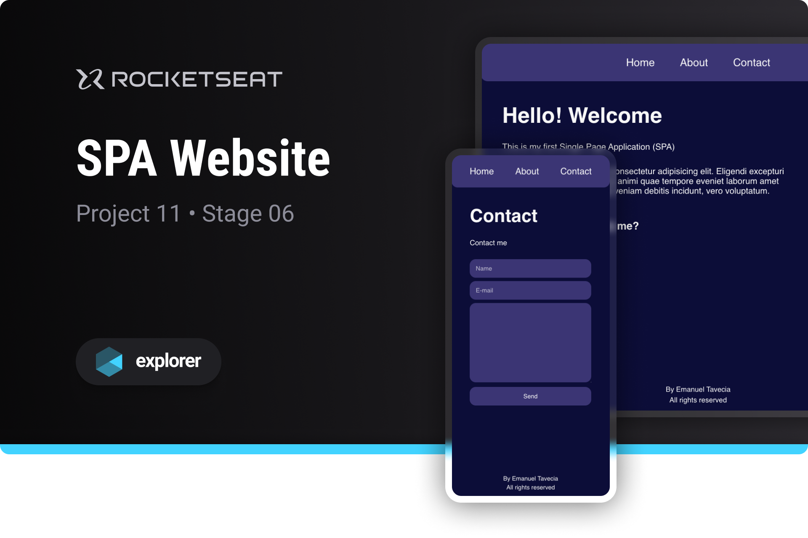

# SPA Website

Project developed on Rocketseat's Explorer course

**SPA Website is a single page application designed to learn basic JavaScript programming concepts**



## 📝 Instructions for use

- Clone the project on your computer:
  ```bash
  git clone https://github.com/emanueltavecia/spa-website.git
  ```

- Access the project folder:
  ```bash
  cd spa-website
  ```

- Install dependencies:
  ```bash
  npm install
  ```

- Run the server:
  ```bash
  npm start
  ```

- Your default browser will open with the SPA Website project

## 📋 Project information

- Rocketseat Explorer
- Stage 06
- Project 11

## 🧠 Concepts learned

The development of this project aims to learn the following concepts:

- SPA concepts
- Routes of an application
- Asynchronous JavaScript Programming
- Object Oriented Programming (OOP)
- Local server with the lite-server library
- First concepts of Node.js

## 💻 Technologies


## 📄 License

This project is licensed under the MIT License - see the [LICENSE](./LICENSE) file for more details.
